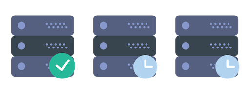
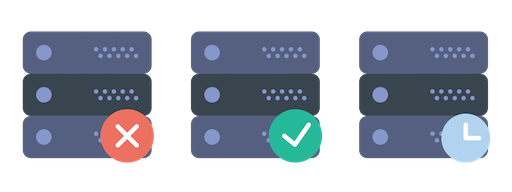

Welcome to celery-beatx's documentation!
========================================

Celery-BeatX is a modern fail-safe schedule for Celery.

Celery-BeatX allows you to store schedule in different storages and
provides functionality to start celery-beat simultaneously at many nodes.

Features:
 * stores schedule in different storages (currently support: redis, memcached)
 * allows to correctly run several instances of celery-beat simultaneously

How it works
------------

Celery is highly scalable distributed task queue. But celery-beat cannot
be scaled to different nodes, because:
 * it stores schedule at local filesystem and doesn't allow syncing it
 * if several instances of beat run simultaneously, each instance will
   queue each task

Celery-BeatX solves both problems:
 * allows you to store schedule in different storages
 * adds lock, so only single instance of celery-beat will be active at a time

Example
~~~~~~~

Consider for example system with 3 nodes with celery-beat.

At the start the 1st node is in active mode, the 2nd and 3d are in stand-by mode.
Only 1st node sends scheduled tasks to queue.

When just started the 1st node acquires lock and renews it at each tick.
Other nodes are checking lock and waiting it to be available for acquiring.

When the 1st node goes down unexpectedly the lock will expire and one of another nodes
will acquire it. So scheduler will continue working normally.

Installation
-------------

The package can be installed using::

    pip install celery-beatx

After package installed you should set celery scheduler::

   celery_app.config_from_object({
      # ...
      'beat_scheduler': 'beatx.schedulers.Scheduler',
      'beatx_store': 'redis://127.0.0.1:6379/',
      # ...
   })

Configuration
-------------

**conf.beatx_store** – URI to schedule storage. Supports schemes:
 * redis:// – redis storage (require ``redis`` package)
 * memcached:// – memcache storage (require ``python-memcached`` package)
 * pylibmc:// – memcache storage using PyLibMC (require ``pylibmc`` package)
 * dummy:// – dummy storage for testing purpose

**conf.beatx_store_lock_ttl** – lock ttl, must be greater then `beat_max_loop_interval`
configuration.

Indices and tables
==================

* :ref:`genindex`
* :ref:`modindex`
* :ref:`search`
